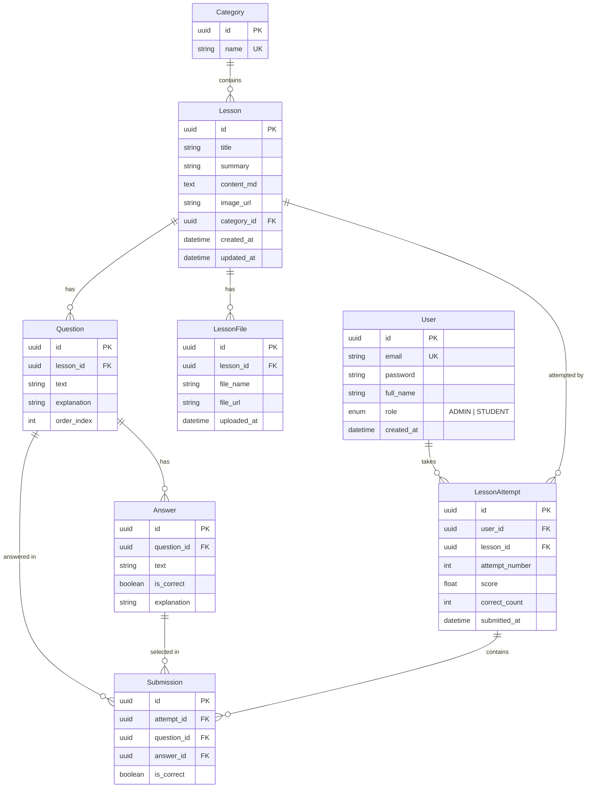

<p align="center">
  
  
  
  
  
  
  
</p>

# 🏨 Azubi Webapp — Hệ thống đào tạo nghiệp vụ khách sạn

> **Azubi** (tiếng Đức: *Auszubildende*) — Nền tảng E-Learning dành cho học viên ngành khách sạn, nơi Admin quản lý bài học và câu hỏi, còn Student tự học, làm quiz và theo dõi tiến độ.

[](https://github.com/yourusername/Azubi_Webapp/actions)


---

## 📖 Mục lục

- [Tổng quan](#-tổng-quan)
- [Demo & Screenshots](#-demo--screenshots)
- [Kiến trúc hệ thống](#-kiến-trúc-hệ-thống)
- [Tech Stack](#-tech-stack)
- [Cấu trúc dự án](#-cấu-trúc-dự-án)
- [Database Schema](#-database-schema)
- [API Reference](#-api-reference)
- [Business Rules](#-business-rules)
- [Cài đặt & Chạy](#-cài-đặt--chạy)
- [Testing](#-testing)
- [Deployment (Production)](#-deployment-production)
- [Quy trình phát triển](#-quy-trình-phát-triển)
- [Tài liệu tham khảo](#-tài-liệu-tham-khảo)

---

## 🎯 Tổng quan

Azubi Webapp giải quyết bài toán **đào tạo nghiệp vụ khách sạn trực tuyến** với hai vai trò chính:

### 👨‍💼 Admin (Quản trị viên)
- Quản lý **danh mục bài học** (Categories)
- Soạn **bài học** với nội dung Markdown, ảnh đại diện, file Word đính kèm
- Tạo bộ **câu hỏi trắc nghiệm** cho từng bài (kéo thả sắp xếp thứ tự)
- Quản lý **tài khoản học viên**
- Theo dõi tiến độ học tập

### 👩‍🎓 Student (Học viên)
- Xem danh sách bài học với trạng thái hoàn thành
- Đọc nội dung bài học (Markdown rendering) và tải file đính kèm
- Làm quiz trắc nghiệm và nhận kết quả ngay
- Xem giải thích chi tiết từng đáp án sau khi nộp bài
- Làm lại quiz không giới hạn số lần
- Theo dõi lịch sử tất cả các lần nộp bài

---

## 📸 Demo & Screenshots

> _Thêm screenshots vào đây sau khi deploy._

| Trang | Mô tả |
|---|---|
| Login | Trang đăng nhập cho Admin/Student |
| Admin Dashboard | Bảng quản lý bài học dạng grid/table |
| Lesson Editor | Soạn bài với Markdown editor + upload ảnh/file |
| Question Manager | Quản lý câu hỏi + đáp án trong bài |
| Student Lessons | Grid bài học với badge trạng thái hoàn thành |
| Quiz | Giao diện làm bài trắc nghiệm (radio single-choice) |
| Quiz Result | Kết quả chi tiết với giải thích từng đáp án |

---

## 🏗 Kiến trúc hệ thống

```
                        ┌─────────────────────────────────────┐
                        │           Nginx (SSL/TLS)           │
                        │    :80 → 301 → :443 (HTTPS)        │
                        │   ┌─────────────┬─────────────┐     │
                        │   │   /api/*    │    /*       │     │
                        │   │   → :3001   │   → :3000   │     │
                        │   └──────┬──────┴──────┬──────┘     │
                        └──────────┼─────────────┼────────────┘
                                   │             │
                 ┌─────────────────┴──┐  ┌───────┴──────────────┐
                 │   NestJS Backend   │  │   Next.js Frontend   │
                 │                    │  │                      │
                 │  ┌──────────────┐  │  │  ┌────────────────┐  │
                 │  │   Auth       │  │  │  │ Admin UI       │  │
                 │  │   (JWT)      │  │  │  │ ─ Lessons      │  │
                 │  ├──────────────┤  │  │  │ ─ Categories   │  │
                 │  │  Admin API   │  │  │  │ ─ Questions    │  │
                 │  │  ─ CRUD      │  │  │  │ ─ Students     │  │
                 │  ├──────────────┤  │  │  ├────────────────┤  │
                 │  │ Student API  │  │  │  │ Student UI     │  │
                 │  │  ─ Lessons   │  │  │  │ ─ Lesson List  │  │
                 │  │  ─ Quiz      │  │  │  │ ─ Quiz Flow    │  │
                 │  │  ─ History   │  │  │  │ ─ History      │  │
                 │  └──────┬───┬──┘  │  │  └────────────────┘  │
                 └─────────┼───┼─────┘  └──────────────────────┘
                           │   │
              ┌────────────┘   └────────────┐
              │                             │
     ┌────────┴─────────┐        ┌──────────┴──────────┐
     │   PostgreSQL 16  │        │   MinIO (S3)        │
     │                  │        │                     │
     │  7 tables        │        │  lesson-images      │
     │  UUID primary    │        │  (public read)      │
     │  keys            │        │                     │
     │                  │        │  lesson-files       │
     │                  │        │  (signed URL)       │
     └──────────────────┘        └─────────────────────┘
```

### Luồng xác thực (Auth Flow)

```
┌──────────┐    POST /auth/login     ┌──────────┐
│          │ ──────────────────────→  │          │
│ Frontend │  ← accessToken (body)   │ Backend  │
│          │  ← refreshToken (cookie)│          │
│          │                         │          │
│  Zustand │   Bearer token          │  JWT     │
│ (memory) │ ──────────────────────→ │  Guard   │
│          │                         │          │
│  Axios   │   401? auto refresh     │  Role    │
│Intercept │ ──── POST /auth/refresh │  Guard   │
│          │  ← new accessToken      │          │
└──────────┘                         └──────────┘
```

- **Access Token**: lưu in-memory (Zustand store), không dùng localStorage
- **Refresh Token**: HttpOnly cookie (`path=/api/auth`, `sameSite=strict`, `secure` in production)
- **Auto-refresh**: Axios response interceptor tự gọi `/auth/refresh` khi nhận 401

---

## 🛠 Tech Stack

### Backend

| Package | Version | Vai trò |
|---|---|---|
| `@nestjs/core` | ^11.0 | Framework chính |
| `@prisma/client` | ^5.22 | ORM & query builder |
| `@nestjs/jwt` | ^11.0 | JWT token generation/verification |
| `@nestjs/passport` | ^11.0 | Authentication strategies |
| `@nestjs/throttler` | latest | Rate limiting (100 req/min global, 5/min login) |
| `@nestjs/swagger` | latest | OpenAPI/Swagger documentation |
| `helmet` | latest | Security HTTP headers |
| `minio` | ^8.0 | S3-compatible file storage client |
| `bcrypt` | ^6.0 | Password hashing |
| `class-validator` | ^0.15 | DTO validation decorators |
| `class-transformer` | ^0.5 | DTO transformation |

### Frontend

| Package | Version | Vai trò |
|---|---|---|
| `next` | ^14.2 | React framework (App Router) |
| `react` | ^18.3 | UI library |
| `@tanstack/react-query` | ^5.90 | Server state management |
| `zustand` | ^5.0 | Client state (auth only) |
| `axios` | ^1.13 | HTTP client with interceptors |
| `react-hook-form` + `zod` | latest | Form management + validation |
| `@uiw/react-md-editor` | ^4.0 | Markdown editor (admin) |
| `react-markdown` | ^10.1 | Markdown renderer (student) |
| `lucide-react` | ^0.577 | Icon library |
| `tailwindcss` | ^3.4 | Utility-first CSS |
| shadcn/ui | latest | UI component library (Radix-based) |

### Infrastructure

| Tool | Version | Vai trò |
|---|---|---|
| PostgreSQL | 16-alpine | Relational database |
| MinIO | latest | S3-compatible object storage |
| Nginx | alpine | Reverse proxy, SSL termination |
| Docker Compose | v2 | Container orchestration |

---

## 📁 Cấu trúc dự án

```
Azubi_Webapp/
│
├── 📂 apps/
│   ├── 📂 backend/                       # ── NestJS API Server ──
│   │   ├── prisma/
│   │   │   ├── schema.prisma             # Database schema (7 models)
│   │   │   └── seed.ts                   # Seed admin account
│   │   ├── src/
│   │   │   ├── main.ts                   # App bootstrap (helmet, CORS, Swagger, throttle)
│   │   │   ├── app.module.ts             # Root module
│   │   │   ├── app.controller.ts         # Health check endpoint
│   │   │   │
│   │   │   ├── 📂 auth/                  # Authentication module
│   │   │   │   ├── auth.controller.ts    #   POST login/logout/refresh, GET me
│   │   │   │   ├── auth.service.ts       #   JWT sign/verify, bcrypt compare
│   │   │   │   ├── jwt.strategy.ts       #   Access token strategy (Bearer)
│   │   │   │   ├── jwt-refresh.strategy.ts#  Refresh token strategy (Cookie)
│   │   │   │   └── dto/login.dto.ts
│   │   │   │
│   │   │   ├── 📂 users/                 # Student management (Admin)
│   │   │   │   ├── users.controller.ts   #   GET/POST/DELETE students
│   │   │   │   └── users.service.ts
│   │   │   │
│   │   │   ├── 📂 categories/            # Category CRUD (Admin)
│   │   │   │   ├── categories.controller.ts
│   │   │   │   ├── categories.service.ts #   BR-06: block delete with lessons
│   │   │   │   └── dto/
│   │   │   │
│   │   │   ├── 📂 lessons/               # Lesson CRUD + file upload (Admin)
│   │   │   │   ├── lessons.controller.ts #   7 endpoints, multipart upload
│   │   │   │   ├── lessons.service.ts    #   MinIO integration, cascade delete
│   │   │   │   └── dto/
│   │   │   │
│   │   │   ├── 📂 questions/             # Question & Answer CRUD (Admin)
│   │   │   │   ├── questions.controller.ts# Nested under lessons/:lessonId
│   │   │   │   ├── questions.service.ts  #   BR-03: min 2 answers, 1 correct
│   │   │   │   └── dto/
│   │   │   │
│   │   │   ├── 📂 student-lessons/       # Student lesson endpoints
│   │   │   │   ├── student-lessons.controller.ts
│   │   │   │   └── student-lessons.service.ts # BR-01, BR-02
│   │   │   │
│   │   │   ├── 📂 submissions/           # Quiz submit + attempt history
│   │   │   │   ├── submissions.controller.ts
│   │   │   │   ├── submissions.service.ts#   Scoring, validation, BR-05
│   │   │   │   └── dto/
│   │   │   │
│   │   │   ├── 📂 files/                 # MinIO service wrapper
│   │   │   │   ├── minio.service.ts      #   Upload, delete, presigned URLs
│   │   │   │   └── files.module.ts
│   │   │   │
│   │   │   ├── 📂 prisma/                # Database service
│   │   │   │   ├── prisma.service.ts     #   Global singleton
│   │   │   │   └── prisma.module.ts
│   │   │   │
│   │   │   └── 📂 common/                # Shared utilities
│   │   │       ├── decorators/           #   @CurrentUser(), @Roles()
│   │   │       ├── guards/               #   JwtAuthGuard, RolesGuard
│   │   │       ├── filters/              #   HttpExceptionFilter (Prisma errors)
│   │   │       └── interceptors/         #   LoggingInterceptor (dev only)
│   │   │
│   │   ├── Dockerfile.dev
│   │   └── Dockerfile.prod
│   │
│   └── 📂 frontend/                      # ── Next.js 14 App Router ──
│       ├── app/
│       │   ├── (auth)/login/             # Login page
│       │   ├── (admin)/admin/            # Admin route group
│       │   │   ├── dashboard/            #   Lesson list (table/grid)
│       │   │   ├── lessons/new/          #   Create lesson
│       │   │   ├── lessons/[id]/edit/    #   Edit lesson + questions + files
│       │   │   ├── categories/           #   Category management
│       │   │   └── students/             #   Student management
│       │   └── (student)/student/        # Student route group
│       │       └── lessons/              #   Lesson list + [id] detail/quiz
│       │
│       ├── components/
│       │   ├── admin/                    # AdminSidebar, CreateStudentDialog
│       │   ├── student/                  # StudentNav, LessonCard, QuizForm,
│       │   │                             # QuizResult, AttemptHistory
│       │   ├── auth/                     # RoleProtectedLayout
│       │   ├── categories/               # CategoryFormDialog
│       │   ├── lessons/                  # LessonForm, LessonFilesManager,
│       │   │                             # MarkdownEditor
│       │   ├── questions/                # QuestionList, QuestionFormDialog
│       │   └── ui/                       # shadcn components (~20 components)
│       │
│       ├── hooks/                        # React Query custom hooks
│       ├── stores/auth-store.ts          # Zustand auth state
│       ├── lib/                          # api.ts, auth.ts, utils.ts
│       ├── types/index.ts                # All TypeScript types
│       ├── Dockerfile.dev
│       └── Dockerfile.prod
│
├── 📂 docker/
│   ├── nginx/
│   │   ├── nginx.conf                    # Production Nginx config
│   │   ├── generate-ssl.sh              # Self-signed SSL cert script
│   │   └── ssl/                          # Certificates (gitignored)
│   └── postgres/init.sql                 # uuid-ossp extension
│
├── docker-compose.yml                    # Development environment
├── docker-compose.prod.yml               # Production environment
├── .env.example                          # Dev environment template
├── .env.production.example               # Production environment template
├── .github/workflows/ci.yml             # CI/CD pipeline
├── Azubi_BRD_v1.1.md                    # Business Requirements Document
└── azubi-project-plan.md                 # Technical Architecture Plan
```

---

## 🗃 Database Schema



**Cascade Rules:**
- `Lesson` → xóa cascade: `LessonFile`, `Question` → `Answer`, `Submission`
- `LessonAttempt` → xóa cascade: `Submission`
- `Category` → **KHÔNG** cascade — phải xóa lessons trước (BR-06)

---

## 🔌 API Reference

API documentation đầy đủ có tại **Swagger UI**: `http://localhost:3001/api/docs` (chỉ trong development)

### Tổng quan endpoints

| Group | Base Path | Endpoints | Auth |
|---|---|---|---|
| 🔐 Auth | `/api/auth` | 4 | Public / Cookie |
| 📂 Categories | `/api/admin/categories` | 5 | Admin |
| 📚 Lessons | `/api/admin/lessons` | 8 | Admin |
| ❓ Questions | `/api/admin/lessons/:id/questions` | 5 | Admin |
| 👥 Students | `/api/admin/students` | 3 | Admin |
| 📖 Student Lessons | `/api/student/lessons` | 3 | Student |
| 📝 Student Quiz | `/api/student/lessons/:id/attempts` | 4 | Student |
| 💚 Health | `/api/health` | 1 | Public |
| **Tổng** | | **33 endpoints** | |

<details>
<summary>📋 Chi tiết từng endpoint (click để mở)</summary>

#### Auth
```
POST   /api/auth/login          Login → accessToken + refreshToken cookie
POST   /api/auth/logout         Clear refreshToken cookie
POST   /api/auth/refresh        Refresh access token (cookie required)
GET    /api/auth/me             Get current user info (Bearer required)
```

#### Admin — Categories
```
GET    /api/admin/categories          List categories (include lessonCount)
GET    /api/admin/categories/:id      Get category by ID
POST   /api/admin/categories          Create { name }
PATCH  /api/admin/categories/:id      Update { name }
DELETE /api/admin/categories/:id      Delete (blocked if has lessons)
```

#### Admin — Lessons
```
GET    /api/admin/lessons?categoryId=  List (optional filter)
GET    /api/admin/lessons/:id          Detail + files + questions
POST   /api/admin/lessons              Create (multipart/form-data)
PATCH  /api/admin/lessons/:id          Update (multipart/form-data)
DELETE /api/admin/lessons/:id          Delete cascade
POST   /api/admin/lessons/:id/files    Upload .docx file
DELETE /api/admin/lessons/:id/files/:fid  Delete file
GET    /api/admin/lessons/:id/files/:fid/download  Signed URL
```

#### Admin — Questions (nested under lessons)
```
GET    /api/admin/lessons/:lid/questions           List + answers
POST   /api/admin/lessons/:lid/questions           Create + answers
PATCH  /api/admin/lessons/:lid/questions/:id       Update + replace answers
DELETE /api/admin/lessons/:lid/questions/:id       Delete cascade
PATCH  /api/admin/lessons/:lid/questions/reorder   Reorder { questionIds }
```

#### Admin — Students
```
GET    /api/admin/students          List all students
POST   /api/admin/students          Create { email, password, fullName }
DELETE /api/admin/students/:id      Delete + cascade attempts
```

#### Student — Lessons
```
GET    /api/student/lessons          Lesson list + isCompleted
GET    /api/student/lessons/:id      Detail (NO explanation/isCorrect)
GET    /api/student/lessons/:id/files/:fid/download  Signed URL
```

#### Student — Quiz
```
POST   /api/student/lessons/:lid/attempts             Submit quiz
GET    /api/student/lessons/:lid/attempts              Attempt history
GET    /api/student/lessons/:lid/attempts/latest       Latest attempt
GET    /api/student/lessons/:lid/attempts/:attemptId   Attempt detail
```

</details>

---

## 📏 Business Rules

| Code | Quy tắc | Chi tiết |
|---|---|---|
| **BR-01** | Trạng thái hoàn thành | `isCompleted = true` khi tồn tại LessonAttempt với `attemptNumber = 1`. Không đổi dù làm lại bao nhiêu lần. |
| **BR-02** | Bảo mật đáp án | **Trước nộp bài:** API student KHÔNG trả `explanation`, `isCorrect`. **Sau nộp:** trả đầy đủ tất cả. |
| **BR-03** | Tính hợp lệ câu hỏi | Mỗi question phải có ≥ 2 answers và ≥ 1 answer correct. Validate cả backend + frontend. |
| **BR-05** | Single-choice | Mỗi câu hỏi chỉ chọn **1 đáp án** duy nhất (radio button, không phải checkbox). |
| **BR-06** | Bảo vệ category | Không cho xóa category nếu còn lesson nào reference tới nó. |

**Quy tắc bổ sung:**
- Student **không tự đăng ký** được — Admin tạo tài khoản
- Student **làm lại quiz không giới hạn** số lần
- Upload: chỉ `.docx` (max 20MB) cho file, `.jpg/.png` (max 5MB) cho ảnh
- Scoring: `score = (correctCount / totalQuestions) * 100` (thang 0-100)

---

## 🚀 Cài đặt & Chạy

### Yêu cầu hệ thống

| Tool | Version |
|---|---|
| Node.js | ≥ 18 |
| Docker & Docker Compose | v2+ |
| Git | latest |

### 1. Clone & cấu hình

```bash
git clone https://github.com/yourusername/Azubi_Webapp.git
cd Azubi_Webapp

# Copy và chỉnh sửa file .env
cp .env.example .env
# Sửa .env: đặt JWT_SECRET, JWT_REFRESH_SECRET, mật khẩu DB/MinIO theo ý muốn
```

### 2. Chạy với Docker (khuyến nghị)

```bash
# Khởi động tất cả services
docker compose up -d

# Kiểm tra logs
docker compose logs -f backend
docker compose logs -f frontend
```

Truy cập:
| Service | URL |
|---|---|
| Frontend | http://localhost:3000 |
| Backend API | http://localhost:3001/api |
| Swagger Docs | http://localhost:3001/api/docs |
| MinIO Console | http://localhost:9001 |

### 3. Chạy local (không Docker)

```bash
# Terminal 1: Backend
cd apps/backend
npm ci
npx prisma generate
npx prisma db push
npx prisma db seed        # Tạo admin account
npm run start:dev

# Terminal 2: Frontend
cd apps/frontend
npm ci
npm run dev
```

### 4. Tài khoản mặc định

| Role | Email | Password |
|---|---|---|
| Admin | `admin@azubi.de` | `Admin123!` |

> ⚠️ **Đổi mật khẩu admin ngay trong production!**

---

## 🧪 Testing

### Backend Tests

```bash
cd apps/backend

npm run test          # Chạy tất cả unit tests
npm run test:cov      # Coverage report
npm run test:e2e      # E2E tests
npm run test:watch    # Watch mode
```

### Frontend Checks

```bash
cd apps/frontend

npm run type-check    # TypeScript compiler check
npm run lint          # ESLint
npm run build         # Production build verification
```

### Coverage Report

| Metric | Target | Actual |
|---|---|---|
| Statements | ≥ 70% | **93.04%** ✅ |
| Branches | ≥ 60% | **71.68%** ✅ |
| Functions | ≥ 70% | **96.57%** ✅ |
| Lines | ≥ 70% | **92.46%** ✅ |

Test coverage bao gồm:
- ✅ Tất cả services (auth, users, categories, lessons, questions, student-lessons, submissions)
- ✅ Tất cả controllers
- ✅ Common utilities (HttpExceptionFilter, RolesGuard, LoggingInterceptor)
- ✅ Auth strategies (JWT, Refresh)
- ✅ MinIO service

---

## 🌐 Deployment (Production)

### 1. Chuẩn bị SSL

```bash
# Tạo self-signed certificate (dev/staging)
chmod +x docker/nginx/generate-ssl.sh
./docker/nginx/generate-ssl.sh

# Hoặc dùng certificate thật (production)
# Copy cert.pem + key.pem vào docker/nginx/ssl/
```

### 2. Cấu hình production

```bash
cp .env.production.example .env

# ⚠️ BẮT BUỘC thay đổi:
# - JWT_SECRET, JWT_REFRESH_SECRET → chuỗi random dài
# - DB_PASSWORD, MINIO_PASSWORD → mật khẩu mạnh
# - CORS_ORIGIN → domain thật (https://yourdomain.com)
# - server_name trong docker/nginx/nginx.conf → domain thật
```

### 3. Deploy

```bash
docker compose -f docker-compose.prod.yml up -d
```

### Production Features

| Feature | Chi tiết |
|---|---|
| **SSL/TLS** | TLSv1.2 + TLSv1.3, `ssl_prefer_server_ciphers on` |
| **Security Headers** | X-Content-Type-Options, X-Frame-Options DENY, X-XSS-Protection, Referrer-Policy |
| **Rate Limiting** | 100 req/min global, 5 req/min cho login (chống brute-force) |
| **Helmet** | Security HTTP headers cho Express |
| **Gzip** | text/plain, application/json, application/javascript, text/css |
| **Health Checks** | PostgreSQL (`pg_isready`) → Backend (`/api/health`) → Frontend |
| **Graceful Startup** | `depends_on: condition: service_healthy` chain |

---

## 🔄 Quy trình phát triển

Dự án được xây dựng qua **5 Phases**, tổng cộng **19 implementation prompts**:

### Phase 1 — Infrastructure & Authentication
| Prompt | Nội dung |
|---|---|
| #1–#5 | Docker setup, NestJS + Next.js scaffold, Prisma schema, JWT auth flow, CI/CD pipeline |

### Phase 2 — Admin Core Features
| Prompt | Nội dung |
|---|---|
| #6 | Categories CRUD (Backend + Frontend) |
| #7 | Lessons CRUD + MinIO file upload (Backend) |
| #8 | Admin Lesson UI (Frontend) |
| #9 | Admin Student Management UI |

### Phase 3 — Questions & Answers
| Prompt | Nội dung |
|---|---|
| #10 | Questions & Answers CRUD API (Backend) |
| #11 | Question Management UI (Frontend, tích hợp vào Edit Lesson) |

### Phase 4 — Student Experience
| Prompt | Nội dung |
|---|---|
| #12 | Student Lesson List + Detail API (Backend) |
| #13 | Student Quiz Submit + History API (Backend) |
| #14 | Student Lesson List + Detail UI (Frontend) |
| #15 | Student Quiz + History UI (Frontend) |

### Phase 5 — Polish & Production
| Prompt | Nội dung |
|---|---|
| #16 | Error Handling + Security Hardening |
| #17 | Docker Production + Nginx SSL |
| #18 | Swagger API Docs |
| #19 | Testing Coverage ≥ 70% (đạt 93%) |

---

## 📚 Tài liệu tham khảo

| Tài liệu | Đường dẫn | Mục đích |
|---|---|---|
| Business Requirements | `Azubi_BRD_v1.1.md` | Yêu cầu nghiệp vụ (source of truth) |
| Project Plan | `azubi-project-plan.md` | Kiến trúc & kế hoạch kỹ thuật |
| Copilot Instructions | `.github/copilot-instructions.md` | Context cho AI coding assistant |
| Swagger API Docs | `http://localhost:3001/api/docs` | Interactive API documentation |
| Dev Env Template | `.env.example` | Environment variables (dev) |
| Prod Env Template | `.env.production.example` | Environment variables (production) |

---

<p align="center">
  <b>Built with ❤️ for the Azubi training program</b><br/>
  <sub>Hệ thống đào tạo nghiệp vụ khách sạn — Azubi Webapp</sub>
</p>
