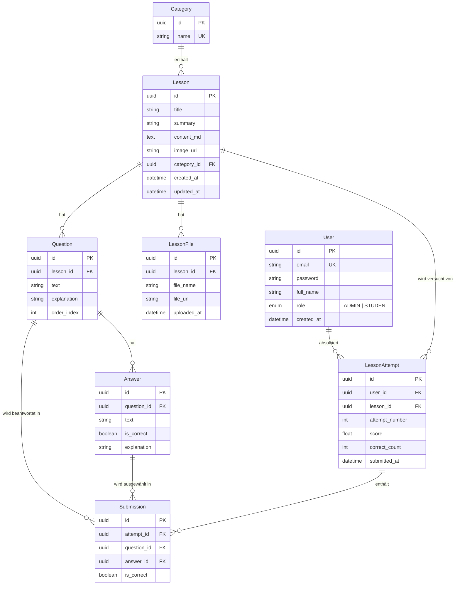

<p align="center">
  
  
  
  
  
  
  
</p>

# 🏨 Azubi Webapp — Digitales Schulungssystem für das Hotelgewerbe

> **Azubi** (*Auszubildende*) — Eine E-Learning-Plattform für Auszubildende im Hotelgewerbe, auf der Administratoren Lektionen und Quizfragen verwalten und Lernende selbstständig lernen, Quizze absolvieren und ihren Fortschritt verfolgen können.

[](https://github.com/yourusername/Azubi_Webapp/actions)


🇻🇳 [Tiếng Việt](README.md) · 🇩🇪 **Deutsch**

---

## 📖 Inhaltsverzeichnis

- [Überblick](#-überblick)
- [Demo & Screenshots](#-demo--screenshots)
- [Systemarchitektur](#-systemarchitektur)
- [Technologie-Stack](#-technologie-stack)
- [Projektstruktur](#-projektstruktur)
- [Datenbankschema](#-datenbankschema)
- [API-Referenz](#-api-referenz)
- [Geschäftsregeln](#-geschäftsregeln)
- [Installation & Start](#-installation--start)
- [Tests](#-tests)
- [Deployment (Produktion)](#-deployment-produktion)
- [Entwicklungsprozess](#-entwicklungsprozess)
- [Dokumentation](#-dokumentation)

---

## 🎯 Überblick

Die Azubi Webapp löst das Problem der **digitalen Berufsausbildung im Hotelgewerbe** mit zwei Hauptrollen:

### 👨‍💼 Admin (Administrator)
- Verwaltung von **Lektionskategorien** (Categories)
- Erstellung von **Lektionen** mit Markdown-Inhalten, Titelbildern und Word-Dateianhängen
- Erstellung von **Multiple-Choice-Quizfragen** pro Lektion (Drag & Drop-Sortierung)
- Verwaltung von **Lernenden-Konten**
- Überwachung des Lernfortschritts

### 👩‍🎓 Student (Lernende/r)
- Ansicht der Lektionsliste mit Abschlussstatus
- Lesen von Lektionsinhalten (Markdown-Rendering) und Herunterladen von Anhängen
- Absolvieren von Quizzen mit sofortigem Ergebnis
- Detaillierte Erklärung jeder Antwort nach der Abgabe
- Unbegrenztes Wiederholen der Quizze
- Einsicht in die vollständige Abgabehistorie

---

## 📸 Demo & Screenshots

> _Screenshots hier einfügen nach dem Deployment._

| Seite | Beschreibung |
|---|---|
| Login | Anmeldeseite für Admin/Student |
| Admin Dashboard | Lektionsverwaltung als Grid/Tabelle |
| Lektions-Editor | Markdown-Editor + Bild-/Datei-Upload |
| Fragenverwaltung | Verwaltung von Fragen + Antworten pro Lektion |
| Lernenden-Lektionen | Lektions-Grid mit Abschluss-Badge |
| Quiz | Quiz-Oberfläche (Single-Choice Radiobuttons) |
| Quizergebnis | Detaillierte Ergebnisse mit Erklärungen |

---

## 🏗 Systemarchitektur

```
                        ┌─────────────────────────────────────┐
                        │          Nginx (SSL/TLS)            │
                        │    :80 → 301 → :443 (HTTPS)        │
                        │   ┌─────────────┬─────────────┐     │
                        │   │   /api/*    │    /*       │     │
                        │   │   → :3001   │   → :3000   │     │
                        │   └──────┬──────┴──────┬──────┘     │
                        └──────────┼─────────────┼────────────┘
                                   │             │
                 ┌─────────────────┴──┐  ┌───────┴──────────────┐
                 │   NestJS Backend   │  │   Next.js Frontend   │
                 │                    │  │                      │
                 │  ┌──────────────┐  │  │  ┌────────────────┐  │
                 │  │   Auth       │  │  │  │ Admin-UI       │  │
                 │  │   (JWT)      │  │  │  │ ─ Lektionen    │  │
                 │  ├──────────────┤  │  │  │ ─ Kategorien   │  │
                 │  │  Admin-API   │  │  │  │ ─ Fragen       │  │
                 │  │  ─ CRUD      │  │  │  │ ─ Lernende     │  │
                 │  ├──────────────┤  │  │  ├────────────────┤  │
                 │  │ Student-API  │  │  │  │ Lernenden-UI   │  │
                 │  │  ─ Lektionen │  │  │  │ ─ Lektionsliste│  │
                 │  │  ─ Quiz      │  │  │  │ ─ Quiz-Flow    │  │
                 │  │  ─ Historie  │  │  │  │ ─ Historie     │  │
                 │  └──────┬───┬──┘  │  │  └────────────────┘  │
                 └─────────┼───┼─────┘  └──────────────────────┘
                           │   │
              ┌────────────┘   └────────────┐
              │                             │
     ┌────────┴─────────┐        ┌──────────┴──────────┐
     │   PostgreSQL 16  │        │   MinIO (S3)        │
     │                  │        │                     │
     │  7 Tabellen      │        │  lesson-images      │
     │  UUID-Primär-    │        │  (öffentlich)       │
     │  schlüssel       │        │                     │
     │                  │        │  lesson-files       │
     │                  │        │  (signierte URL)    │
     └──────────────────┘        └─────────────────────┘
```

### Authentifizierungsablauf

```
┌──────────┐    POST /auth/login     ┌──────────┐
│          │ ──────────────────────→  │          │
│ Frontend │  ← accessToken (Body)   │ Backend  │
│          │  ← refreshToken (Cookie)│          │
│          │                         │          │
│  Zustand │   Bearer-Token          │  JWT     │
│ (Memory) │ ──────────────────────→ │  Guard   │
│          │                         │          │
│  Axios   │   401? Auto-Refresh     │  Rollen- │
│Intercept.│ ──── POST /auth/refresh │  Guard   │
│          │  ← neues accessToken    │          │
└──────────┘                         └──────────┘
```

- **Access Token**: im Speicher (Zustand Store), kein localStorage
- **Refresh Token**: HttpOnly-Cookie (`path=/api/auth`, `sameSite=strict`, `secure` in Produktion)
- **Auto-Refresh**: Axios-Response-Interceptor ruft automatisch `/auth/refresh` bei 401-Fehler auf

---

## 🛠 Technologie-Stack

### Backend

| Paket | Version | Funktion |
|---|---|---|
| `@nestjs/core` | ^11.0 | Hauptframework |
| `@prisma/client` | ^5.22 | ORM & Query Builder |
| `@nestjs/jwt` | ^11.0 | JWT-Token-Erstellung/-Prüfung |
| `@nestjs/passport` | ^11.0 | Authentifizierungsstrategien |
| `@nestjs/throttler` | aktuell | Ratenbegrenzung (100 Req/Min global, 5/Min Login) |
| `@nestjs/swagger` | aktuell | OpenAPI/Swagger-Dokumentation |
| `helmet` | aktuell | Sicherheits-HTTP-Header |
| `minio` | ^8.0 | S3-kompatibler Dateispeicher-Client |
| `bcrypt` | ^6.0 | Passwort-Hashing |
| `class-validator` | ^0.15 | DTO-Validierungs-Decorators |

### Frontend

| Paket | Version | Funktion |
|---|---|---|
| `next` | ^14.2 | React-Framework (App Router) |
| `react` | ^18.3 | UI-Bibliothek |
| `@tanstack/react-query` | ^5.90 | Server-State-Management |
| `zustand` | ^5.0 | Client-State (nur Auth) |
| `axios` | ^1.13 | HTTP-Client mit Interceptors |
| `react-hook-form` + `zod` | aktuell | Formularverwaltung + Validierung |
| `@uiw/react-md-editor` | ^4.0 | Markdown-Editor (Admin) |
| `react-markdown` | ^10.1 | Markdown-Renderer (Student) |
| `lucide-react` | ^0.577 | Icon-Bibliothek |
| `tailwindcss` | ^3.4 | Utility-First CSS |
| shadcn/ui | aktuell | UI-Komponentenbibliothek (Radix-basiert) |

### Infrastruktur

| Werkzeug | Version | Funktion |
|---|---|---|
| PostgreSQL | 16-alpine | Relationale Datenbank |
| MinIO | aktuell | S3-kompatibler Objektspeicher |
| Nginx | alpine | Reverse Proxy, SSL-Terminierung |
| Docker Compose | v2 | Container-Orchestrierung |

---

## 📁 Projektstruktur

```
Azubi_Webapp/
│
├── 📂 apps/
│   ├── 📂 backend/                       # ── NestJS API-Server ──
│   │   ├── prisma/
│   │   │   ├── schema.prisma             # Datenbankschema (7 Modelle)
│   │   │   └── seed.ts                   # Admin-Konto erstellen
│   │   ├── src/
│   │   │   ├── main.ts                   # App-Bootstrap (Helmet, CORS, Swagger, Throttle)
│   │   │   ├── app.module.ts             # Hauptmodul
│   │   │   ├── app.controller.ts         # Health-Check-Endpunkt
│   │   │   ├── 📂 auth/                  # Authentifizierungsmodul
│   │   │   ├── 📂 users/                 # Lernendenverwaltung (Admin)
│   │   │   ├── 📂 categories/            # Kategorien-CRUD (Admin)
│   │   │   ├── 📂 lessons/               # Lektionen-CRUD + Datei-Upload (Admin)
│   │   │   ├── 📂 questions/             # Fragen & Antworten-CRUD (Admin)
│   │   │   ├── 📂 student-lessons/       # Lernenden-Lektionsendpunkte
│   │   │   ├── 📂 submissions/           # Quiz-Abgabe + Versuchshistorie
│   │   │   ├── 📂 files/                 # MinIO-Service-Wrapper
│   │   │   ├── 📂 prisma/                # Datenbank-Service
│   │   │   └── 📂 common/                # Gemeinsame Hilfsmittel
│   │   │       ├── decorators/           #   @CurrentUser(), @Roles()
│   │   │       ├── guards/               #   JwtAuthGuard, RolesGuard
│   │   │       ├── filters/              #   HttpExceptionFilter
│   │   │       └── interceptors/         #   LoggingInterceptor
│   │   ├── Dockerfile.dev
│   │   └── Dockerfile.prod
│   │
│   └── 📂 frontend/                      # ── Next.js 14 App Router ──
│       ├── app/
│       │   ├── (auth)/login/             # Anmeldeseite
│       │   ├── (admin)/admin/            # Admin-Routengruppe
│       │   │   ├── dashboard/            #   Lektionsliste
│       │   │   ├── lessons/              #   Erstellen + Bearbeiten
│       │   │   ├── categories/           #   Kategorienverwaltung
│       │   │   └── students/             #   Lernendenverwaltung
│       │   └── (student)/student/        # Lernenden-Routengruppe
│       │       └── lessons/              #   Lektionsliste + Detail/Quiz
│       ├── components/                   # React-Komponenten
│       ├── hooks/                        # React Query Custom Hooks
│       ├── stores/auth-store.ts          # Zustand Auth-State
│       ├── lib/                          # api.ts, auth.ts, utils.ts
│       └── types/index.ts               # Alle TypeScript-Typen
│
├── 📂 docker/
│   ├── nginx/                            # Nginx-Konfiguration + SSL
│   └── postgres/init.sql                 # UUID-Erweiterung
│
├── docker-compose.yml                    # Entwicklungsumgebung
├── docker-compose.prod.yml               # Produktionsumgebung
├── .env.example                          # Umgebungsvariablen (Dev)
├── .env.production.example               # Umgebungsvariablen (Prod)
├── Azubi_BRD_v1.1.md                    # Geschäftsanforderungen
└── azubi-project-plan.md                 # Technische Architektur
```

---

## 🗃 Datenbankschema



**Kaskadierungsregeln:**
- `Lesson` → kaskadierendes Löschen: `LessonFile`, `Question` → `Answer`, `Submission`
- `LessonAttempt` → kaskadierendes Löschen: `Submission`
- `Category` → **KEINE** Kaskadierung — Lektionen müssen zuerst entfernt werden (BR-06)

---

## 🔌 API-Referenz

Die vollständige API-Dokumentation ist verfügbar unter **Swagger UI**: `http://localhost:3001/api/docs` (nur in der Entwicklungsumgebung)

### Endpunkt-Übersicht

| Gruppe | Basispfad | Endpunkte | Auth |
|---|---|---|---|
| 🔐 Auth | `/api/auth` | 4 | Öffentlich / Cookie |
| 📂 Kategorien | `/api/admin/categories` | 5 | Admin |
| 📚 Lektionen | `/api/admin/lessons` | 8 | Admin |
| ❓ Fragen | `/api/admin/lessons/:id/questions` | 5 | Admin |
| 👥 Lernende | `/api/admin/students` | 3 | Admin |
| 📖 Lernenden-Lektionen | `/api/student/lessons` | 3 | Student |
| 📝 Lernenden-Quiz | `/api/student/lessons/:id/attempts` | 4 | Student |
| 💚 Zustandsprüfung | `/api/health` | 1 | Öffentlich |
| **Gesamt** | | **33 Endpunkte** | |

<details>
<summary>📋 Details aller Endpunkte (zum Öffnen klicken)</summary>

#### Auth
```
POST   /api/auth/login          Anmeldung → accessToken + refreshToken-Cookie
POST   /api/auth/logout         refreshToken-Cookie löschen
POST   /api/auth/refresh        Access Token erneuern (Cookie erforderlich)
GET    /api/auth/me             Aktuelle Benutzerinfo abrufen (Bearer erforderlich)
```

#### Admin — Kategorien
```
GET    /api/admin/categories          Alle Kategorien (inkl. Lektionsanzahl)
GET    /api/admin/categories/:id      Kategorie nach ID
POST   /api/admin/categories          Erstellen { name }
PATCH  /api/admin/categories/:id      Aktualisieren { name }
DELETE /api/admin/categories/:id      Löschen (gesperrt bei vorh. Lektionen)
```

#### Admin — Lektionen
```
GET    /api/admin/lessons?categoryId=  Liste (optionaler Filter)
GET    /api/admin/lessons/:id          Detail + Dateien + Fragen
POST   /api/admin/lessons              Erstellen (multipart/form-data)
PATCH  /api/admin/lessons/:id          Aktualisieren (multipart/form-data)
DELETE /api/admin/lessons/:id          Kaskadierend löschen
POST   /api/admin/lessons/:id/files    Word-Datei hochladen
DELETE /api/admin/lessons/:id/files/:fid  Datei löschen
GET    /api/admin/lessons/:id/files/:fid/download  Signierte URL
```

#### Admin — Fragen (unter Lektionen verschachtelt)
```
GET    /api/admin/lessons/:lid/questions           Liste + Antworten
POST   /api/admin/lessons/:lid/questions           Erstellen + Antworten
PATCH  /api/admin/lessons/:lid/questions/:id       Aktualisieren + Antworten ersetzen
DELETE /api/admin/lessons/:lid/questions/:id       Kaskadierend löschen
PATCH  /api/admin/lessons/:lid/questions/reorder   Umsortieren { questionIds }
```

#### Admin — Lernende
```
GET    /api/admin/students          Alle Lernenden auflisten
POST   /api/admin/students          Erstellen { email, password, fullName }
DELETE /api/admin/students/:id      Löschen + kaskadierende Versuche
```

#### Lernende — Lektionen
```
GET    /api/student/lessons          Lektionsliste + isCompleted
GET    /api/student/lessons/:id      Detail (OHNE Erklärung/isCorrect)
GET    /api/student/lessons/:id/files/:fid/download  Signierte URL
```

#### Lernende — Quiz
```
POST   /api/student/lessons/:lid/attempts             Quiz abgeben
GET    /api/student/lessons/:lid/attempts              Versuchshistorie
GET    /api/student/lessons/:lid/attempts/latest       Letzter Versuch
GET    /api/student/lessons/:lid/attempts/:attemptId   Versuchsdetail
```

</details>

---

## 📏 Geschäftsregeln

| Code | Regel | Details |
|---|---|---|
| **BR-01** | Abschlussstatus | `isCompleted = true` wenn ein LessonAttempt mit `attemptNumber = 1` existiert. Ändert sich nicht bei Wiederholungen. |
| **BR-02** | Antwortsicherheit | **Vor Abgabe:** API liefert KEINE `explanation`, `isCorrect`. **Nach Abgabe:** vollständige Rückgabe aller Informationen. |
| **BR-03** | Fragengültigkeit | Jede Frage muss ≥ 2 Antworten und ≥ 1 korrekte Antwort haben. Validierung im Backend + Frontend. |
| **BR-05** | Single-Choice | Pro Frage wird nur **eine Antwort** ausgewählt (Radiobutton, kein Checkbox). |
| **BR-06** | Kategorieschutz | Kategorien können nicht gelöscht werden, solange Lektionen darauf verweisen. |

**Zusätzliche Regeln:**
- Lernende können sich **nicht selbst registrieren** — Admins erstellen die Konten
- Lernende können Quizze **unbegrenzt wiederholen**
- Upload: nur `.docx` (max 20 MB) für Dateien, `.jpg/.png` (max 5 MB) für Bilder
- Bewertung: `score = (correctCount / totalQuestions) × 100` (Skala 0–100)

---

## 🚀 Installation & Start

### Systemvoraussetzungen

| Werkzeug | Version |
|---|---|
| Node.js | ≥ 18 |
| Docker & Docker Compose | v2+ |
| Git | aktuell |

### 1. Klonen & Konfigurieren

```bash
git clone https://github.com/yourusername/Azubi_Webapp.git
cd Azubi_Webapp

# .env-Datei kopieren und anpassen
cp .env.example .env
# .env bearbeiten: JWT_SECRET, JWT_REFRESH_SECRET, DB-/MinIO-Passwörter setzen
```

### 2. Mit Docker starten (empfohlen)

```bash
# Alle Dienste starten
docker compose up -d

# Logs anzeigen
docker compose logs -f backend
docker compose logs -f frontend
```

Zugriff:
| Dienst | URL |
|---|---|
| Frontend | http://localhost:3000 |
| Backend-API | http://localhost:3001/api |
| Swagger-Dokumentation | http://localhost:3001/api/docs |
| MinIO-Konsole | http://localhost:9001 |

### 3. Lokal starten (ohne Docker)

```bash
# Terminal 1: Backend
cd apps/backend
npm ci
npx prisma generate
npx prisma db push
npx prisma db seed        # Admin-Konto erstellen
npm run start:dev

# Terminal 2: Frontend
cd apps/frontend
npm ci
npm run dev
```

### 4. Standard-Zugangsdaten

| Rolle | E-Mail | Passwort |
|---|---|---|
| Admin | `admin@azubi.de` | `Admin123!` |

> ⚠️ **Admin-Passwort in der Produktion sofort ändern!**

---

## 🧪 Tests

### Backend-Tests

```bash
cd apps/backend

npm run test          # Alle Unit-Tests ausführen
npm run test:cov      # Abdeckungsbericht
npm run test:e2e      # E2E-Tests
npm run test:watch    # Beobachtungsmodus
```

### Frontend-Prüfungen

```bash
cd apps/frontend

npm run type-check    # TypeScript-Compiler-Prüfung
npm run lint          # ESLint
npm run build         # Produktions-Build-Überprüfung
```

### Abdeckungsbericht

| Metrik | Ziel | Ergebnis |
|---|---|---|
| Statements | ≥ 70 % | **93,04 %** ✅ |
| Branches | ≥ 60 % | **71,68 %** ✅ |
| Functions | ≥ 70 % | **96,57 %** ✅ |
| Lines | ≥ 70 % | **92,46 %** ✅ |

Die Testabdeckung umfasst:
- ✅ Alle Services (auth, users, categories, lessons, questions, student-lessons, submissions)
- ✅ Alle Controller
- ✅ Gemeinsame Utilities (HttpExceptionFilter, RolesGuard, LoggingInterceptor)
- ✅ Auth-Strategien (JWT, Refresh)
- ✅ MinIO-Service

---

## 🌐 Deployment (Produktion)

### 1. SSL vorbereiten

```bash
# Selbstsigniertes Zertifikat erstellen (Entwicklung/Staging)
chmod +x docker/nginx/generate-ssl.sh
./docker/nginx/generate-ssl.sh

# Oder echtes Zertifikat verwenden (Produktion)
# cert.pem + key.pem nach docker/nginx/ssl/ kopieren
```

### 2. Produktionskonfiguration

```bash
cp .env.production.example .env

# ⚠️ PFLICHTÄNDERUNGEN:
# - JWT_SECRET, JWT_REFRESH_SECRET → lange Zufallszeichenketten
# - DB_PASSWORD, MINIO_PASSWORD → starke Passwörter
# - CORS_ORIGIN → echte Domain (https://ihredomain.com)
# - server_name in docker/nginx/nginx.conf → echte Domain
```

### 3. Bereitstellen

```bash
docker compose -f docker-compose.prod.yml up -d
```

### Produktionsfunktionen

| Funktion | Details |
|---|---|
| **SSL/TLS** | TLSv1.2 + TLSv1.3, `ssl_prefer_server_ciphers on` |
| **Sicherheitsheader** | X-Content-Type-Options, X-Frame-Options DENY, X-XSS-Protection, Referrer-Policy |
| **Ratenbegrenzung** | 100 Anfragen/Min global, 5 Anfragen/Min für Login (Brute-Force-Schutz) |
| **Helmet** | Sicherheits-HTTP-Header für Express |
| **Gzip** | text/plain, application/json, application/javascript, text/css |
| **Zustandsprüfungen** | PostgreSQL (`pg_isready`) → Backend (`/api/health`) → Frontend |
| **Geordneter Start** | `depends_on: condition: service_healthy`-Kette |

---

## 🔄 Entwicklungsprozess

Das Projekt wurde in **5 Phasen** mit insgesamt **19 Implementierungsprompts** aufgebaut:

### Phase 1 — Infrastruktur & Authentifizierung
| Prompt | Inhalt |
|---|---|
| #1–#5 | Docker-Setup, NestJS + Next.js Gerüst, Prisma-Schema, JWT-Auth-Flow, CI/CD-Pipeline |

### Phase 2 — Admin-Kernfunktionen
| Prompt | Inhalt |
|---|---|
| #6 | Kategorien-CRUD (Backend + Frontend) |
| #7 | Lektionen-CRUD + MinIO-Datei-Upload (Backend) |
| #8 | Admin-Lektions-UI (Frontend) |
| #9 | Admin-Lernendenverwaltung-UI |

### Phase 3 — Fragen & Antworten
| Prompt | Inhalt |
|---|---|
| #10 | Fragen- & Antworten-CRUD-API (Backend) |
| #11 | Fragenverwaltungs-UI (Frontend, integriert in Lektionsbearbeitung) |

### Phase 4 — Lernendenerfahrung
| Prompt | Inhalt |
|---|---|
| #12 | Lernenden-Lektionsliste + Detail-API (Backend) |
| #13 | Lernenden-Quiz-Abgabe + Historie-API (Backend) |
| #14 | Lernenden-Lektionsliste + Detail-UI (Frontend) |
| #15 | Lernenden-Quiz + Historie-UI (Frontend) |

### Phase 5 — Verfeinerung & Produktion
| Prompt | Inhalt |
|---|---|
| #16 | Fehlerbehandlung + Sicherheitshärtung |
| #17 | Docker-Produktion + Nginx SSL |
| #18 | Swagger-API-Dokumentation |
| #19 | Testabdeckung ≥ 70 % (erreicht: 93 %) |

---

## 📚 Dokumentation

| Dokument | Pfad | Zweck |
|---|---|---|
| Geschäftsanforderungen | `Azubi_BRD_v1.1.md` | Fachliche Anforderungen (Quelle der Wahrheit) |
| Projektplan | `azubi-project-plan.md` | Architektur & technischer Plan |
| Copilot-Anweisungen | `.github/copilot-instructions.md` | Kontext für KI-Coding-Assistenten |
| Swagger-API-Dokumentation | `http://localhost:3001/api/docs` | Interaktive API-Dokumentation |
| Umgebungsvorlage (Dev) | `.env.example` | Umgebungsvariablen (Entwicklung) |
| Umgebungsvorlage (Prod) | `.env.production.example` | Umgebungsvariablen (Produktion) |

---

<p align="center">
  <b>Mit ❤️ entwickelt für das Azubi-Ausbildungsprogramm</b><br/>
  <sub>Digitales Schulungssystem für das Hotelgewerbe — Azubi Webapp</sub>
</p>
